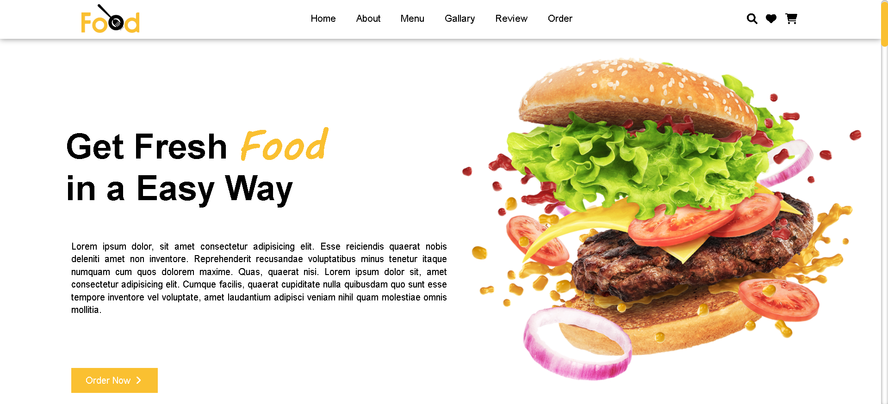

# Food Store - Responsive Food Website

A modern, responsive, and visually appealing multi-page single-layout website for a food delivery service or restaurant.

#

## 🚀 Features

- **Responsive Design:** Fully compatible with desktops, tablets, and smartphones.
- **Smooth Navigation:** Interactive navigation bar with smooth scrolling to sections (Home, About, Menu, Gallery, Review, Order).
- **Interactive Menu:** Detailed food menu cards with hover effects, pricing, and rating systems.
- **Order System:** A dedicated ordering section with a functional form UI for capturing customer details.
- **Customer Reviews:** A stylized section to showcase customer feedback and testimonials.
- **Social Media Integration:** Links to social platforms in the footer using FontAwesome icons.

## 📋 Prerequisites

To view and run this project, you only need:
- A modern web browser (Google Chrome, Mozilla Firefox, Microsoft Edge, etc.).

## 📂 Project Structure

```plaintext
├── index.html          # The main HTML structure
├── style.css           # Custom CSS for styling (Link expected)
├── image/              # Folder containing logos and food images
└── README.md           # Project documentation
